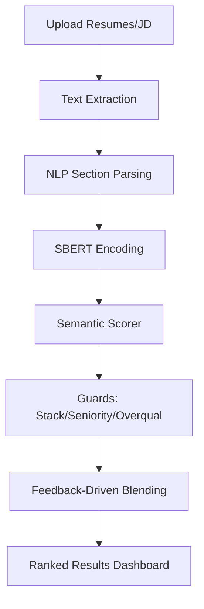

# 📄 Semantic AI-Based Resume Screening System

A state-of-the-art **AI-driven recruitment engine** that moves beyond traditional keyword matching. This system leverages Large Language Models (LLMs) and Semantic Search to understand the deep context of engineering resumes and job descriptions (JDs).

Built with **Sentence-Transformers (SBERT)**, **Flask**, and **MongoDB**, it provides recruiters with a high-precision, explainable ranking of candidates.

---

## 🚀 Key Technical Features

### 1. Semantic Intelligence
- **Contextual Ranking**: Uses `all-MiniLM-L6-v2` embeddings to compare resumes against JDs semantically.
- **Ontology-Based Matching**: Bridges the gap between similar terms (e.g., "SQL" match with "PostgreSQL") and handles negation/acronyms.
- **Section-Aware Scoring**: Separately evaluates **Skills**, **Experience**, and **Projects** with dynamic weighting.

### 2. Advanced Screening "Guards"
- **Stack Guard (Anchor Detection)**: Automatically identifies the core technology (e.g., JAVA, PYTHON, NODE) and applies affinity bonuses for stack matches.
- **Experience Calibration**: 
  - **Seniority Penalty**: Softened penalties for high-potential junior candidates vs. senior requirements.
  - **Overqualification Guard**: Detects if a candidate exceeds the JD experience limit significantly.
- **Strength/Gap Analysis**: Generates readable AI insights for each candidate's profile.

### 3. Feedback-Driven Learning
- **Recruiter Preference Bias**: Learns from "Shortlist" and "Reject" actions.
- **Weight Adaptation**: Automatically recalibrates importance weights (Skills vs. Exp) based on historical hiring patterns.
- **Persistent Memory**: MongoDB-backed session and preference tracking.

---

## 🛠 Tech Stack

- **Backend**: Python / Flask
- **Machine Learning**: Sentence-Transformers (LLM Embeddings), Spacy (NLP), Scikit-Learn
- **Database**: MongoDB (Atlas) for persistent storage and analytics
- **Frontend**: Responsive UI with interactive dashboards and status tracking
- **Deployment**: Docker / Hugging Face Spaces

---

## 💻 Local Setup & Development

### Prerequisite: Environment
Ensure you have Python 3.9+ installed and a MongoDB instance running (or a MongoDB Atlas URI).

1. **Clone the repository**:
   ```bash
   git clone <repository-url>
   cd resume-screening
   ```

2. **Setup Virtual Environment**:
   ```bash
   python3 -m venv venv
   source venv/bin/activate  # On Windows: venv\Scripts\activate
   pip install -r requirements.txt
   ```

3. **Configure Environment Variables**:
   Create a `.env` file in the root:
   ```env
   MONGO_URI=your_mongodb_uri
   SECRET_KEY=your_secret_key
   ```

4. **Run the Application**:
   ```bash
   python3 app.py
   ```
   Access at `http://localhost:5001`

---

## 🐳 Docker Deployment

1. **Build the Image**:
   ```bash
   docker build -t resume-screening .
   ```

2. **Run the Container**:
   ```bash
   docker run -p 7860:7860 \
     -e MONGO_URI="mongodb_atlas_uri" \
     resume-screening
   ```

---

## 📊 Architecture Overview



---

## 🤝 Contribution

Contributions are welcome. To get started, clone the repository, set up the virtual environment, and run `python3 app.py` to start the development server.
