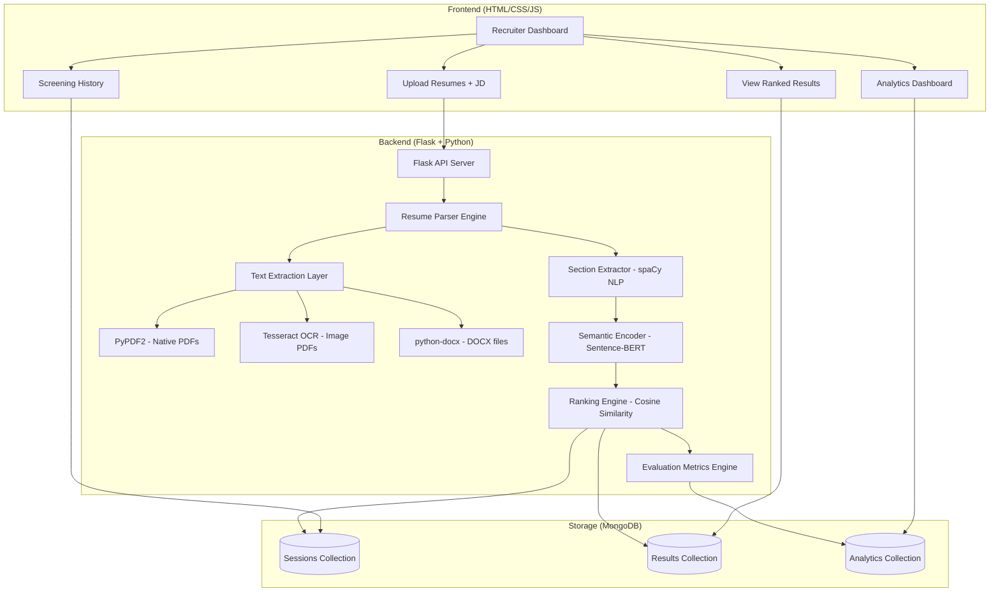
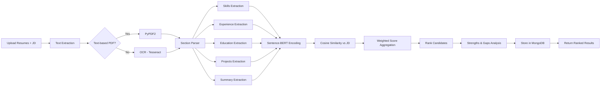

# AI-Based Resume Screening Using ML Models

## Problem Statement

Traditional ATS systems rely on **keyword matching** — if a resume doesn't contain the exact keyword, it's rejected, even if the candidate is highly qualified. This project replaces that with **semantic understanding** using NLP and ML, enabling:

- Understanding of resume context (not just keywords)
- Intelligent ranking of 100s–1000s of candidates against a job description
- Section-aware analysis (Skills, Experience, Education, Projects are weighted differently)

## Architecture Overview



## User Review Required

> [!IMPORTANT]
> **Frontend Template**: You mentioned you'll provide a frontend template to avoid looking AI-generated. Please share the template (HTML/CSS files) when we reach the frontend phase. I'll build the backend first so it's ready to plug into any UI.

> [!IMPORTANT]
> **Kaggle Dataset**: The dataset (~2GB) contains image-based PDFs organized by job category (Data Science, Accountant, Python Developer, etc.). These require **OCR extraction** via Tesseract. You'll need to download and place it in the project. We'll also support direct text-based PDF upload from recruiters.

> [!WARNING]
> **System Dependencies**: Tesseract OCR and Poppler (for pdf2image) must be installed on your Mac. I'll handle this via Homebrew during setup.

---

## Proposed Changes

### Phase 1: Project Foundation & Setup

#### [NEW] Project Structure
```
Resume Screening/
├── app.py                      # Flask application entry point
├── config.py                   # Configuration management
├── requirements.txt            # Python dependencies
├── .env                        # Environment variables
├── models/                     # ML model management
│   ├── __init__.py
│   └── embedder.py             # Sentence-BERT wrapper
├── pipeline/                   # Core ML pipeline
│   ├── __init__.py
│   ├── extractor.py            # Text extraction (PDF, DOCX, OCR)
│   ├── section_parser.py       # Resume section identification
│   ├── semantic_scorer.py      # Embedding + cosine similarity
│   ├── ranker.py               # Final ranking logic
│   └── evaluator.py            # Evaluation metrics
├── database/                   # MongoDB layer
│   ├── __init__.py
│   └── db.py                   # Database operations
├── routes/                     # Flask routes/APIs
│   ├── __init__.py
│   ├── screening.py            # Upload & screen endpoints
│   ├── results.py              # Results & ranking endpoints
│   └── analytics.py            # Analytics endpoints
├── templates/                  # Jinja2 HTML templates (your template goes here)
│   ├── base.html
│   ├── index.html
│   ├── upload.html
│   ├── results.html
│   ├── analytics.html
│   └── history.html
├── static/                     # CSS, JS, images
│   ├── css/
│   ├── js/
│   └── assets/
├── uploads/                    # Temporary resume storage
├── data/                       # Kaggle dataset (gitignored)
└── tests/                      # Unit tests
```

#### [NEW] requirements.txt
```
# Core Framework
Flask==3.1.0
python-dotenv==1.1.0
pymongo==4.12.0

# Text Extraction
PyPDF2==3.0.1
pytesseract==0.3.13
pdf2image==1.17.0
python-docx==1.1.2

# NLP & ML
sentence-transformers==3.4.1
torch>=2.0.0
spacy==3.8.4
scikit-learn==1.6.1
numpy==2.2.4

# Utilities
Werkzeug==3.1.3
```

---

### Phase 2: Text Extraction Engine

#### [NEW] pipeline/extractor.py

This is the first critical component — extracting clean text from any resume format.

**Strategy:**
1. **Native PDFs** (text-selectable): Use `PyPDF2` for fast, accurate extraction
2. **Image-based PDFs** (scanned/Kaggle dataset): Use `pdf2image` → `pytesseract` OCR
3. **DOCX files**: Use `python-docx`
4. **Auto-detection**: Try PyPDF2 first; if extracted text is too short/empty, fall back to OCR

```python
# Pseudocode
def extract_text(file_path):
    if file_path.endswith('.docx'):
        return extract_docx(file_path)
    
    # Try native PDF extraction first
    text = extract_pdf_native(file_path)
    
    # If too little text extracted, it's likely an image PDF → OCR
    if len(text.strip()) < 50:
        text = extract_pdf_ocr(file_path)
    
    return clean_text(text)
```

---

### Phase 3: Resume Section Parser (NLP)

#### [NEW] pipeline/section_parser.py

This is where NLP shines. Instead of treating the resume as a flat blob of text, we **intelligently segment it** into meaningful sections.

**Approach:**
1. Use **spaCy** for sentence tokenization and NER
2. Use **regex + heuristic rules** to detect section headers (e.g., "EXPERIENCE", "EDUCATION", "SKILLS", "PROJECTS")
3. Map content under each header to its section
4. Extract structured entities: names, emails, phone numbers, dates, organizations

**Section Categories:**
| Section | What we extract | Weight in Ranking |
|---------|----------------|-------------------|
| **Skills** | Technical skills, tools, languages | 25% |
| **Experience** | Job titles, companies, durations, responsibilities | 30% |
| **Education** | Degrees, institutions, GPA, coursework | 20% |
| **Projects** | Project descriptions, technologies used | 20% |
| **Summary/Objective** | Career summary, objective statement | 5% |

> [!NOTE]
> These weights are **configurable by the recruiter** per screening session. For a senior role, they might weight Experience at 50%. For a fresh graduate role, Education and Projects would be weighted higher.

---

### Phase 4: Semantic Encoding (The ML Core)

#### [NEW] models/embedder.py

**Model Choice: `all-MiniLM-L6-v2`** from Sentence-Transformers

**Why this model:**
- 384-dimensional embeddings (compact, fast)
- Trained on 1B+ sentence pairs for semantic similarity
- ~80MB model size (lightweight, no GPU required)
- State-of-the-art for semantic textual similarity
- Genuinely **unsupervised** — no fine-tuning needed for our use case

**How it works:**
```
Resume Section → Sentence-BERT → 384-dim Vector
Job Description → Sentence-BERT → 384-dim Vector
Similarity = cosine(resume_vector, jd_vector)
```

**Section-Aware Encoding:**
Rather than encoding the entire resume as one blob (which loses section context), we:
1. Encode each resume section **separately**
2. Encode the corresponding aspect of the JD separately
3. Compute weighted similarity across sections

```python
# Pseudocode
def compute_semantic_score(resume_sections, jd_text, weights):
    jd_embedding = model.encode(jd_text)
    
    section_scores = {}
    for section_name, section_text in resume_sections.items():
        section_embedding = model.encode(section_text)
        section_scores[section_name] = cosine_similarity(section_embedding, jd_embedding)
    
    # Weighted combination
    final_score = sum(weights[s] * section_scores[s] for s in section_scores)
    return final_score, section_scores
```

---

### Phase 5: Ranking Engine

#### [NEW] pipeline/ranker.py

**Ranking Strategy:**
1. Parse all resumes → Extract sections
2. Encode all sections using SBERT
3. Compute weighted cosine similarity against JD
4. Sort by final score (descending)
5. Assign rank and percentile

**Output per candidate:**
```json
{
    "rank": 1,
    "candidate_name": "John Doe",
    "overall_score": 0.847,
    "percentile": 99,
    "section_scores": {
        "skills": 0.91,
        "experience": 0.85,
        "education": 0.78,
        "projects": 0.89,
        "summary": 0.72
    },
    "strengths": ["Strong Python/ML skills matching JD", "3+ years relevant experience"],
    "gaps": ["No cloud experience mentioned", "Missing SQL skills"]
}
```

**Strengths & Gaps Analysis:**
- Compare JD-required skills with detected resume skills
- Use semantic similarity (not keyword match) to find near-matches
- Flag genuine gaps where similarity is below threshold

---

### Phase 6: Evaluation Metrics (Academic Requirement)

#### [NEW] pipeline/evaluator.py

Since this is **unsupervised** (no ground truth labels), we use established proxy metrics:

| Metric | What it measures | How we compute it |
|--------|-----------------|-------------------|
| **Score Distribution Entropy** | Discriminative power of the model | Shannon entropy of similarity score distribution. Higher = better discrimination |
| **Rank Stability (Kendall's τ)** | Robustness to perturbations | Synonym-replace words in JD, re-rank, measure correlation with original ranking |
| **Section Ablation Sensitivity** | Whether model uses sections correctly | Remove each section, re-rank, measure Δ in rankings |
| **Precision@K (Human-in-loop)** | Practical accuracy | Recruiter marks top-K as relevant/irrelevant |
| **Keyword-vs-Semantic Comparison** | Improvement over baseline ATS | Run same resumes through TF-IDF keyword matcher, compare rankings |
| **Spearman's ρ** | Correlation with heuristic signals | Correlate SBERT ranking with years-of-experience ranking |
| **Silhouette Score** | Clustering quality of similar resumes | K-Means on embeddings, measure cluster cohesion |

> [!TIP]
> The **Keyword-vs-Semantic Comparison** is especially valuable for your project report — it directly demonstrates why your ML approach outperforms traditional ATS.

---

### Phase 7: Database Layer (MongoDB)

#### [NEW] database/db.py

**Why MongoDB:**
- Resumes are semi-structured documents — perfect fit for document DB
- Flexible schema for different resume structures
- Easy to store embeddings as arrays
- You've used it before in this project

**Collections:**
- `sessions` — Each screening session (JD + uploaded resumes)
- `candidates` — Parsed resume data + embeddings + scores
- `analytics` — Aggregated metrics per session

---

### Phase 8: Flask API Backend

#### [NEW] routes/screening.py, routes/results.py, routes/analytics.py

**Key Endpoints:**

| Method | Endpoint | Description |
|--------|----------|-------------|
| `POST` | `/api/screen` | Upload resumes + JD, trigger screening |
| `GET` | `/api/results/<session_id>` | Get ranked results for a session |
| `GET` | `/api/candidate/<id>` | Get detailed candidate analysis |
| `GET` | `/api/analytics/<session_id>` | Get evaluation metrics |
| `GET` | `/api/history` | List all screening sessions |
| `PUT` | `/api/weights` | Update section weights |
| `GET` | `/api/compare/<session_id>` | Keyword vs Semantic comparison |

---

### Phase 9: Frontend (Your Template)

Once you provide your HTML/CSS template, I'll integrate it with the Flask backend. The frontend will include:

1. **Upload Page** — Drag-and-drop resumes + JD textarea
2. **Results Page** — Ranked candidate cards with section-wise scores, radar charts
3. **Candidate Detail** — Full breakdown, strengths/gaps, comparison
4. **Analytics Dashboard** — Evaluation metrics, score distributions, keyword vs semantic charts
5. **History** — Past screening sessions

> I'll build a functional default UI first, and then swap in your template when you share it.

---

## ML Pipeline Flow (End-to-End)



---

## Open Questions

> [!IMPORTANT]
> 1. **Frontend Template**: When will you share your HTML/CSS template? Should I build a default UI first and swap later, or wait for your template?

> [!IMPORTANT]
> 2. **Kaggle Dataset**: Do you want to download and integrate the Kaggle dataset now for testing, or would you prefer to test with a small set of sample resumes first?

> [!NOTE]
> 3. **MongoDB**: Do you already have MongoDB installed on your Mac, or should I set it up?

> [!NOTE]
> 4. **Section Weights**: The default weights I proposed are Skills(25%), Experience(30%), Education(20%), Projects(20%), Summary(5%). Are you happy with these defaults, or want to adjust?

---

## Verification Plan

### Automated Tests
1. **Unit Tests**: Test each pipeline component (extraction, parsing, encoding, ranking)
2. **Integration Test**: Upload 10 sample resumes + JD, verify ranked output
3. **OCR Accuracy Test**: Compare OCR output against known text for Kaggle image PDFs
4. **Evaluation Metrics**: Run full metric suite and verify scores are within expected ranges

### Manual Verification
1. Upload diverse resumes (different formats, lengths, domains)
2. Verify section parsing accuracy visually
3. Check that ranking makes semantic sense (not just keyword matching)
4. Compare model ranking vs keyword-based ranking to demonstrate improvement

### Academic Validation
1. Run keyword-vs-semantic comparison experiment
2. Generate evaluation metric charts for project report
3. Test adversarial cases (negated skills, synonym-heavy resumes)
